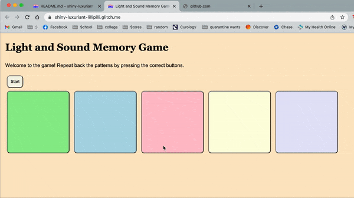
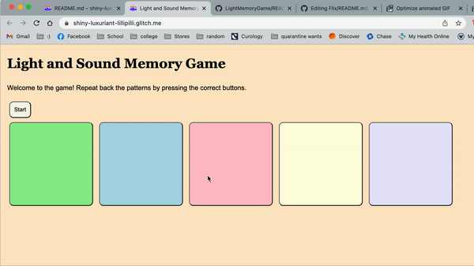
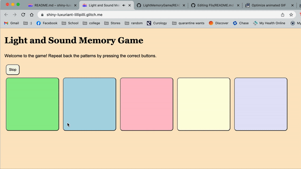

# Pre-work - *Memory Game*

**Memory Game** is a Light & Sound Memory game to apply for CodePath's SITE Program. 

Submitted by: **Chelsea Chu**

Time spent: **2.5** hours spent in total

Link to project: https://glitch.com/edit/#!/shiny-luxuriant-lillipilli

## Required Functionality

The following **required** functionality is complete:

* [✓] Game interface has a heading (h1 tag), a line of body text (p tag), and four buttons that match the demo app
* [✓] "Start" button toggles between "Start" and "Stop" when clicked. 
* [✓] Game buttons each light up and play a sound when clicked. 
* [✓] Computer plays back sequence of clues including sound and visual cue for each button
* [✓] Play progresses to the next turn (the user gets the next step in the pattern) after a correct guess. 
* [✓] User wins the game after guessing a complete pattern
* [✓] User loses the game after an incorrect guess

The following **optional** features are implemented:

* [✓] Any HTML page elements (including game buttons) has been styled differently than in the tutorial
* [✓] Buttons use a pitch (frequency) other than the ones in the tutorial
* [✓] More than 4 functional game buttons
* [✓] Playback speeds up on each turn
* [ ] Computer picks a different pattern each time the game is played
* [✓] Player only loses after 3 mistakes (instead of on the first mistake)
* [ ] Game button appearance change goes beyond color (e.g. add an image)
* [ ] Game button sound is more complex than a single tone (e.g. an audio file, a chord, a sequence of multiple tones)
* [ ] User has a limited amount of time to enter their guess on each turn

## Video Walkthrough (GIF)
Losing the Game:
(html page elements styled differently, 5 game buttons shown, 3 strikes shown)
  

Winning the Game: 
(html page elements styled differently, 5 game buttons shown, playback speeds up on each turn shown)
Part 1 
  
Part 2
  

## Reflection Questions
1. If you used any outside resources to help complete your submission (websites, books, people, etc) list them here.  
  I referred to https://www.w3schools.com/css//css_font_websafe.asp when deciding on fonts.
  I also referred to https://www.w3schools.com/cssref/css_colors.asp for deciding on colors for my buttons and background.

2. What was a challenge you encountered in creating this submission (be specific)? How did you overcome it? (recommended 200 - 400 words)  
  While working on this project, a challenge I encountered was getting the sequence of clues to play after the first turn. Initially, only the first clue was playing and even after the player guessed, the next set of clues did not play. I made sure to look over the functions that could pertain to this issue. I went over the playClueSequence() function to make sure the code in there made sense. I then looked to where the playClueSequence was meant to be called, which is mainly after every guess. I then had to refer to my guess() function and looked through my nested if statements and made sure the conditions made sense for when the clues are meant to play. I realized one of my conditions for my if statement wasn’t set up correctly, causing the rest of the if statements within it not being able to execute. This was just one example of how debugging may take place sometimes, and it often requires thorough search and breaking down code line by line.

3. What questions about web development do you have after completing your submission? (recommended 100 - 300 words)  
  Throughout the course of completing this pre-work, I have found myself to be increasingly more interested in web development and html. After completing my submission, I definitely am more curious about Javascript and what functions are already built into it, and how they can tie into web development and intertwine with HTML and CSS. Furthermore, I’m curious about the other available HTML attributes, as we used onMouseDown and onMouseUp. I think it’d be quite interesting to use the different attributes in web development and user interaction. I’m also wondering how multiple HTML, JS, and CSS files could be incorporated into one project. I’m aware that many HTMLl files could be needed depending on how complex the project or website may be, however I have not had the experience of using CSS files for styling, so I’m intrigued by how multiple files may be needed or used. 

4. If you had a few more hours to work on this project, what would you spend them doing (for example: refactoring certain functions, adding additional features, etc). Be specific. (recommended 100 - 300 words)  
  If I had some more time to work on this project, I would dedicate my time towards altering the layout and designing the display of the website. For example, I’d want to center the elements of the webpage, like the titles, captions, and buttons. I’d also want to explore the different fonts, colors, physical features, etc. that I could play around with and use to improve the design of the overall display and make it more visually appealing. 
I’d also be interested in making the game a little more challenging, perhaps by having random arrays be generated so that the pattern of the buttons wouldn‘t be the same every time. Additionally, I think an entertaining feature to add would be to switch up the order of the buttons after every clue, that way players would truly have to remember the colors/sounds rather than the placements of their buttons.

## Interview Recording URL Link

[My 5-minute Interview Recording](your-link-here)

## License

    Copyright [Chelsea Chu]

    Licensed under the Apache License, Version 2.0 (the "License");
    you may not use this file except in compliance with the License.
    You may obtain a copy of the License at

        http://www.apache.org/licenses/LICENSE-2.0

    Unless required by applicable law or agreed to in writing, software
    distributed under the License is distributed on an "AS IS" BASIS,
    WITHOUT WARRANTIES OR CONDITIONS OF ANY KIND, either express or implied.
    See the License for the specific language governing permissions and
    limitations under the License.
